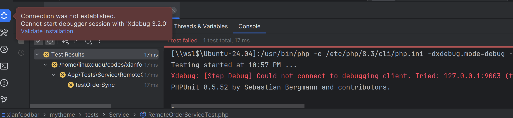
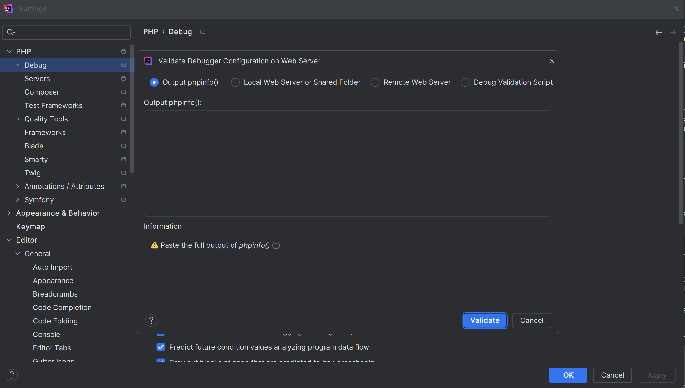
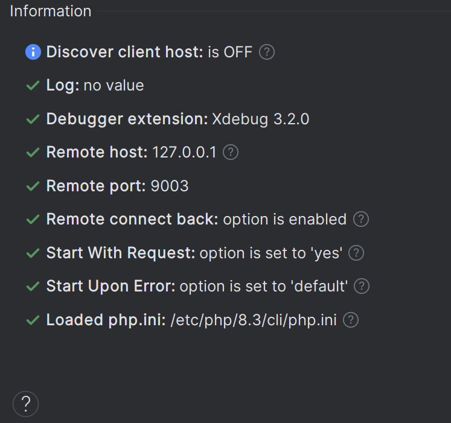
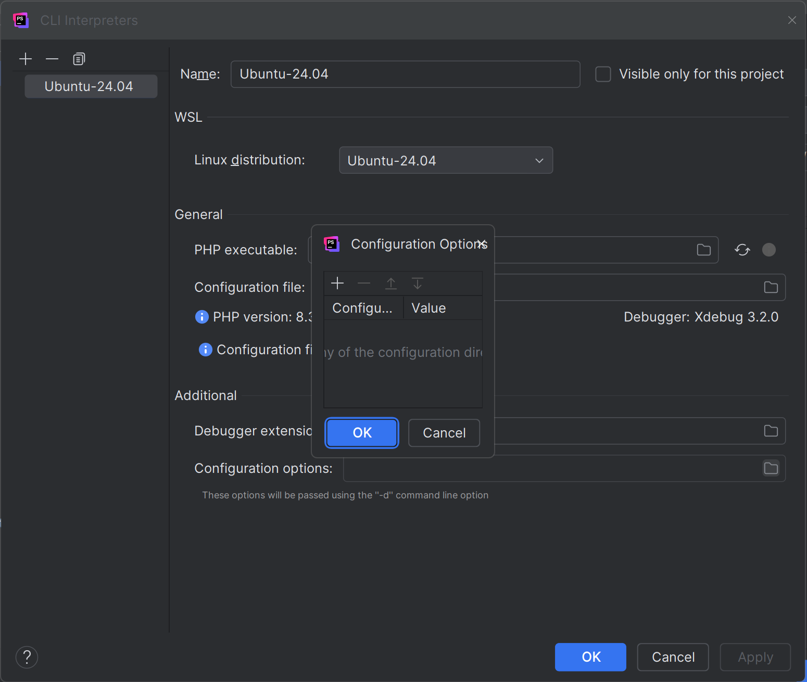
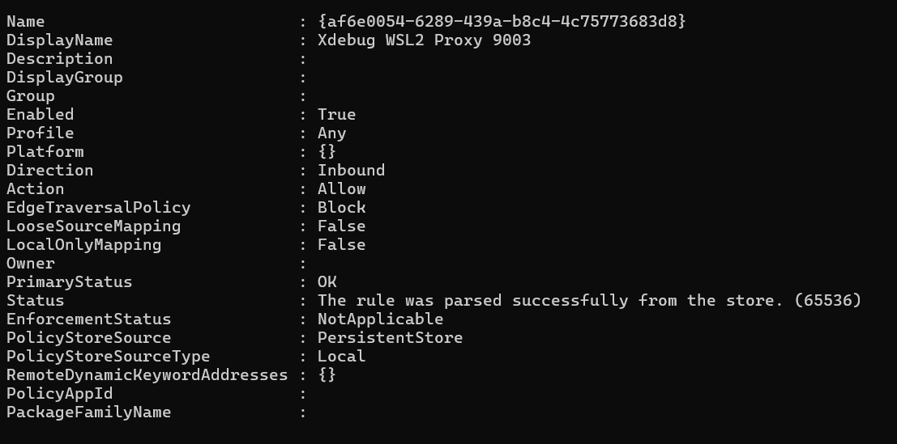
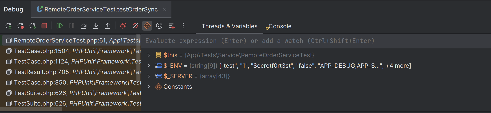

# How to set up Xdebug with WSL2 + PhpStorm on Windows


## Environment
- OS: Windows 11 Pro
- WSL2 with Ubuntu 24.04

- PHP 8.3 on WSL2
- Xdebug 3.2.0 on WSL2
- PhpStorm 2025.01 on Windows

# The problem: The default Xdebug configuration for PhpStorm does not work with WSL2

I followed the installation and configuration of Xdebug provided by PhpStorm and Xdebug official.

link: 

https://www.jetbrains.com/help/phpstorm/2025.1/configuring-xdebug.html?php.debugging.zero_configuration&keymap=VSCode&utm_source=product&utm_medium=link&utm_campaign=PS&utm_content=2025.1
https://xdebug.org/docs/install

However, the default configuration does not work with WSL2. When I try to start a debugging session in PhpStorm, it fails to connect to Xdebug running in WSL2.

The error message in PhpStorm is:
```powershell
[\\wsl$\Ubuntu-24.04]:/usr/bin/php -c /etc/php/8.3/cli/php.ini -dxdebug.mode=debug -dxdebug.client_port=9003 -dxdebug.client_host=127.0.0.1 /home/linuxdudu/codes/xianfoodbar/mytheme/vendor/phpunit/phpunit/phpunit --configuration /home/linuxdudu/codes/xianfoodbar/mytheme/phpunit.xml.dist --filter "/(App\\Tests\\Service\\RemoteOrderServiceTest::testOrderSync)( .*)?$/" --test-suffix RemoteOrderServiceTest.php /home/linuxdudu/codes/xianfoodbar/mytheme/tests/Service --teamcity
Testing started at 9:44 PM ...
Xdebug: [Step Debug] Could not connect to debugging client. Tried: 127.0.0.1:9003 (through xdebug.client_host/xdebug.client_port).
PHPUnit 8.5.52 by Sebastian Bergmann and contributors.

```

# Diagnosis

1. Check the Xdebug if installed correctly by running the following command in WSL2 terminal. 
We can see that Xdebug is installed and enabled, and the configuration is correct.
```bash
php -v

PHP 8.3.6 (cli) (built: May 25 2026 13:12:06) (NTS)
Copyright (c) The PHP Group
Zend Engine v4.3.6, Copyright (c) Zend Technologies
    with Zend OPcache v8.3.6, Copyright (c), by Zend Technologies
    with Xdebug v3.2.0, Copyright (c) 2002-2022, by Derick Rethans
    
apt list --installed | grep xdebug

php-xdebug/noble,now 3.2.0+3.1.6+2.9.8+2.8.1+2.5.5-3ubuntu1 amd64 [installed]
php8.3-xdebug/noble,now 3.2.0+3.1.6+2.9.8+2.8.1+2.5.5-3ubuntu1 amd64 [installed,automatic]
```

2. Check the php.ini configuration for Xdebug. Double check if it follows the official docs from PhpStorm. It is correct, too.
```bash
cat /etc/php/8.3/cli/conf.d/20-xdebug.ini
zend_extension=xdebug.so

cat /etc/php/8.3/cli/php.ini | grep xdebug
xdebug.client_host => 127.0.0.1 => 127.0.0.1
xdebug.client_port => 9003 => 9003
xdebug.mode => debug => debug
xdebug.start_with_request => yes => yes
xdebug.discover_client_host => Off => Off
```

# Analysis: Why the Default Xdebug Setup Doesn't Work
## The WSL2 Network Isolation
When you run **PHP inside WSL2** and **PhpStorm on Windows**, they are on **different network interfaces**:

The official Xdebug installation guide assumes that your **PHP runtime** and your **IDE** are running on the **same machine** (or at least on the same network interface). In that scenario, setting `xdebug.client_host=127.0.0.1` works.

WSL2 runs a virtual machine with its own network stack. This means that the `127.0.0.1` inside WSL2 refers to the WSL2 environment itself, not the Windows host. When Xdebug tries to connect to `127.0.0.1:9003`, it looks for a debug client inside WSL2 — which doesn't exist. PhpStorm is on the Windows side at a different IP address.

┌─────────────────────────────────────┐
│           Windows Host              │
│                                     │
│   PhpStorm listens on 0.0.0.0:9003  │
│                                     │
│   WSL2 Virtual Network Adapter      │
│   Windows side IP: 172.28.16.1      │
│                                     │
│  ┌───────────────────────────────┐  │
│  │  WSL2 (Ubuntu-24.04)          │  │
│  │                               │  │
│  │  PHP + Xdebug runs here       │  │
│  │  127.0.0.1 = WSL2 itself      │  │
│  │  172.28.16.1 = Windows host   │  │
│  └───────────────────────────────┘  │
└─────────────────────────────────────┘

---
# Solve the problem
## Step 1: Find the Windows Host IP Address from WSL2

Run this in WSL2 terminal: 
```bash
ip route show default
# default via 172.28.16.1 dev eth0 proto kernel
# or 
ip route show default | awk '{print $3}'
# 172.28.16.1
```
> AI assistant suggested command `cat /etc/resolv.conf | grep nameserver | awk '{print $2}'`
> This command is not right. It is used to find the DNS server IP address. Even though in WSL2, the DNS server is usually the same as the Windows host IP address, it is not guaranteed.

## Step 2: Update Xdebug Configuration
Edit the Xdebug configuration file in WSL2, `xdebug.client_host`
```bash
sudo nano /etc/php/8.3/cli/conf.d/20-xdebug.ini
```
And validate by
```bash
php -i | grep xdebug.client_host
# xdebug.client_host => 172.28.16.1 => 172.28.16.1
```
> Remember to use `sudo`. Most of the time, the Xdebug configuration file is owned by root, and you don't have permission to edit it

Run debug in PhpStorm again. 
Still got same error message. 
Carefully check the error message, the host 127.0.0.1 has not changed. 
```powershell
[\\wsl$\Ubuntu-24.04]:/usr/bin/php -c /etc/php/8.3/cli/php.ini -dxdebug.mode=debug -dxdebug.client_port=9003 -dxdebug.client_host=127.0.0.1 /home/linuxdudu/codes/xianfoodbar/mytheme/vendor/phpunit/phpunit/phpunit --configuration /home/linuxdudu/codes/xianfoodbar/mytheme/phpunit.xml.dist --filter "/(App\\Tests\\Service\\RemoteOrderServiceTest::testOrderSync)( .*)?$/" --test-suffix RemoteOrderServiceTest.php /home/linuxdudu/codes/xianfoodbar/mytheme/tests/Service --teamcity
Testing started at 10:37 PM ...
Xdebug: [Step Debug] Could not connect to debugging client. Tried: 127.0.0.1:9003 (through xdebug.client_host/xdebug.client_port).
PHPUnit 8.5.52 by Sebastian Bergmann and contributors.
```

## Step 3: Stop and verify again
Try restart PhpStorm and run debug again. The error persists.

Try validate the Xdebug configuration by running the command in WSL2:
```bash
php -i
```
And put the output into PhpStorm -> Settings -> PHP -> Debug -> validate button. The Xdebug configuration is correct.



## What might be wrong: PhpStorm auto-injects 127.0.0.1

When PhpStorm runs PHP with a WSL2 interpreter, it **injects** `client_host` via a command-line flag:

```bash
php \
  -dxdebug.mode=debug \
  -dxdebug.client_port=9003 \
  -dxdebug.client_host=127.0.0.1 \   ← PhpStorm auto-injects this
  /path/to/phpunit ...
```

Assumption:
> ⚠️ **PhpStorm does NOT read `php.ini` to determine `client_host`.**  
> It always injects its own value via CLI flag, which **overrides** whatever is in `php.ini`.  
> For WSL2 interpreters, PhpStorm's auto-detected default is still `127.0.0.1` — which is wrong.

Add additional option flag to Xdebug in PhpStorm. In PhpStorm, 
1. Open **Settings → PHP → CLI Interpreters** 
2. Click your **WSL2 PHP interpreter**
3. Find the **"Additional configuration options"** field
and add the following:
  `xdebug.client_host` with value `172.28.16.1`


Test again, now we get a new error message:
```powershell
Xdebug: [Step Debug] Time-out connecting to debugging client, waited: 200 ms. Tried: 172.28.16.1:9003 (through xdebug.client_host/xdebug.client_port).
```
GOOD NEWS! We got some progress.

## What might still be wrong: Windows Firewall blocks the connection

Even with the correct IP, Windows Firewall may block the incoming connection from WSL2.


### Confirm WSL2 can reach Windows host (WSL2 terminal)

I didn't get expect result. I got a timeout error after a few minutes. 
```bash
nc -zv 172.28.16.1 9003
# Expected: Connection to 172.28.16.1 9003 port [tcp/*] succeeded!
```

### Fix: Allow Port 9003 Through Windows Firewall

Run in **PowerShell as Administrator**:

```powershell
New-NetFirewallRule `
  -DisplayName "Xdebug WSL2 Proxy 9003" `
  -Direction Inbound `
  -Protocol TCP `
  -LocalPort 9003 `
  -Action Allow `
  -Profile Any `
  -InterfaceType Any
```


Validate the Firewall Rule

```powershell
Get-NetFirewallRule -DisplayName "Xdebug WSL2 Proxy 9003" | Select-Object DisplayName, Enabled, Direction, Action
```

Expected output:
```
DisplayName            Enabled Direction Action
-----------            ------- --------- ------
Xdebug WSL2 Proxy 9003    True  Inbound  Allow
```

Remove the Firewall Rule if needed

```powershell
Remove-NetFirewallRule -DisplayName "Xdebug WSL2 Proxy 9003"
```
Validate again with `nc` in WSL2 terminal. We get Connection to 172.28.16.1 9003 port [tcp/*] succeeded! 
```bash
nc -zv 172.28.16.1 9003
```

Test the debug again in PhpStorm.
WOW! Now it works!


The command message when it works:
```powershell
[\\wsl$\Ubuntu-24.04]:/usr/bin/php -c /etc/php/8.3/cli/php.ini -dxdebug.mode=debug -dxdebug.client_port=9003 -dxdebug.client_host=127.0.0.1 -dxdebug.client_host=172.28.16.1 /home/linuxdudu/codes/xianfoodbar/mytheme/vendor/phpunit/phpunit/phpunit --configuration /home/linuxdudu/codes/xianfoodbar/mytheme/phpunit.xml.dist --filter "/(App\\Tests\\Service\\RemoteOrderServiceTest::testOrderSync)( .*)?$/" --test-suffix RemoteOrderServiceTest.php /home/linuxdudu/codes/xianfoodbar/mytheme/tests/Service --teamcity
Testing started at 11:00 PM ...
Testing started at 11:00 PM ...
PHPUnit 8.5.52 by Sebastian Bergmann and contributors.
```

# Other potential issues and fixes
if PhpStorm listens only on `127.0.0.1`. Add a Port Proxy.

If `netstat -ano | findstr ":9003"` shows `127.0.0.1:9003` instead of `0.0.0.0:9003`, PhpStorm is only listening on localhost. Use a port proxy to forward WSL2 traffic:

```powershell
netsh interface portproxy add v4tov4 `
  listenaddress=172.28.16.1 `
  listenport=9003 `
  connectaddress=127.0.0.1 `
  connectport=9003
```

Verify it was added:

```powershell
netsh interface portproxy show all
```

# Summary

| Problem | Cause | Fix |
|---|---|---|
| `Could not connect` to `127.0.0.1:9003` | PhpStorm injects `127.0.0.1` by default; `127.0.0.1` is WSL2 itself, not Windows | Add `-dxdebug.client_host=172.28.16.1` to "Additional configuration options" |
| Connection refused from WSL2 | Windows Firewall blocking port 9003 | Add inbound firewall rule |
| PhpStorm not receiving connections | Listening on `127.0.0.1` only | Add `netsh` port proxy |
| IP changes after reboot | WSL2 gateway IP is dynamic | Re-check IP with `ip route show default` |


# P.S. The Easter Egg: the real bug - Leading Space in "Additional Configuration Options"

A common mistake is accidentally typing a **leading space** before the IP. Yeah, I am talking about myself. I added a space after `-dxdebug.client_host=`, which cost me hours of debugging. Hope this article can save you from the same mistakes.

```
# Wrong — leading space after = corrupts the value
-dxdebug.client_host= 172.28.16.1

# Correct — no space
-dxdebug.client_host=172.28.16.1
```